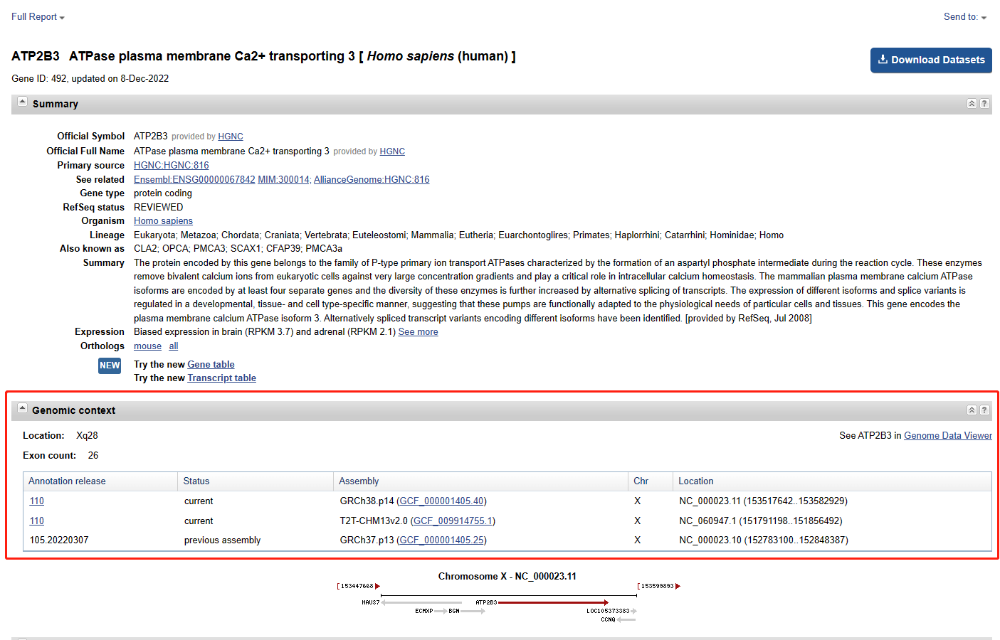

# NCBI人类基因爬取工具

@Time: 2023-02-09

@Email: luohaosen@oriseq.com

## 一、环境配置

- python ——3.9.12
- pandas ——1.5.3
- numpy —— 1.21.1
- request ——2.28.2
- faker —— 16.6.1
- lxml —— 4.9.2

==以上均可通过conda环境即可完成配置==

```sh
conda install package-name
```

## 二、使用方式

- 嵌入自己的python程序使用

```python
# 引入路径
import sys
sys.path.append('脚本程序的父目录')

# 导入类
from ncbi_gene_table import NcbiGeneParser
```

> 以ipython为例，ipython需要自己安装 `conda install ipython`


```python
NcbiGeneParser(ncbi_id=None, find_gene_name=None, save_html_dir=None)
```

- `NcbiGeneParser类`，共有三个可选参数，其中
- `.dataframe`属性、`.save_html_content`属性需要用到的参数需要用到的参数
  
  - `ncbi_id`，是每个ncbi的基因都有的。例子中的NCBI id是51710，这个可以在ncbi上面查询到，以及由他人提供索引表，一个基因对应一个NCBI ID
  
  - `find_gene_name`，是要查找的基因名称。例子中是以一个基因名和id为例，如果想实现批量嵌入程序的时候可以写一个逐行读取的步骤，每一行都导入基因名和基因的ID，可以做到批量生成数据框。==**推荐每一次爬取时都保存一次单个dataframe**==，待所有基因和id爬取结束后，再手动合并所有爬取的表格
  
  - `save_html_dir`，是用于保存html格式的文件，为可选选项，看需求考虑是否填写，不填写不会干扰表格的生成，保存html和表格生成不是一起实现的，可以分开实现，用到的是 NcbiGeneParser类中的`save_html_content`属性，使用时直接在定义对象后写`.save_html_content`即可

## 三、初衷

> 初始需求主要是为了爬取NCBI的人类Gene数据，通过解析如下表格，实现数据库的制作。以人类的三种参考基因组版本(hg19，hg38，T2T)为固定版本，如果出现非这三种版本的参考基因组名称，将补充到后面，具体这一块还没有实际测试过（~~主要就是没有其他物种的基因id~~），感兴趣的、以及会改程序的人可以尝试在工具脚本的基础上进一步修改



## 四、许可说明

- 脚本不允许商业用途，仅可做科学研究使用
- 脚本编写不易，测试了将近1周多的时间，转载请联系，谢谢合作！